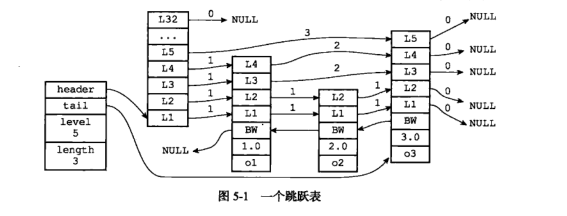

# 1 String(simple dynamic string)
redis没有使用c语言的字符串，自定义了simple dynamic string，存储的值可以是字符串、整数、浮点数
## 1.1 结构
    struct sds{
        //记录buf数组中已经使用的字节数量，等于sds已经保存的字符串的长度
        int length;
        //记录buff中未使用的字节数量
        int free;
        //字节数组
        char buf[];
    }sds;    
使用结构体的方式，结构体里面包括字符串的字符数组，字符的长度，字符的最后一位保留了和c语言语法一样的\0作为结尾
## 1.2 string实现的特性
### 1.2.1 O(1)复杂度获取字符串的长度
### 1.2.2 杜绝缓冲区溢出
    char a[10] = "hello";               
    strcat(a, " world");               
    strcpy(a, "hello world"); 
### 1.2.3 减少修改字符串时带来的内存重分配次数    
空间预分配：当对SDS修改的时候如果len的属性值小于1MB则分配两倍len长度的未使用空间，len的属性值大于1MB的时候分配1MB的未使用空间。 
惰性空间释放：当SDS修改时候，减少的已使用空间被分配到未使用的部分，保留在SDS中。'
### 1.2.4 二进制安全  
C语言使用’\0’作为判定字符串的结尾，如果你保存的字符串内存在’\0’，c语言自会识别前面的数据，导致后面的数据被忽略，所以是不安全的。而redis是使用了独立的len，这样可以保证即使存储的数据中有’\0’这样的字符，它也是可以支持读取的。 
### 1.2.5 兼容部分C的字符串函数 

## 1.3 SDS对象的命令行操作
    Set msg "hello word"  添加msg到数据库中
    Set msg "hello word"  当msg不存在的时候 是添加一个 存在的时候就是对键的修改
    Del msg               删除msg
    
    如果字符串是整形或者浮点型的话 可以对字符串执行自增、自减、加法、减法、加浮点数的操作命令
    set  value 1          value = 1
    incr  value           value = 2
    decr value            value = 1
    incrby value 100      value = 101
    decrby value 10       value = 91
    
    incrbyfloat value 10.22  value = 101.22

# 2 List
list是由链表实现，链表上的每个值都是一个string
## 2.1 结构
		/*
		redis中实现的链表和其他的高级语言是一样的逻辑，使用前节点和后节点的结构 
		实现双向来链表。
		*/
		typdef struct listNode{
            //前节点
            struct listNode *prev;
            //后节点
            struct listNode *next;
            //节点值
            void *value; 
            }listNode;
            /*
            list
		*/
		
		typedef struct list{
            //表头结点
            listNode *head;
            //表尾节点
            listNode *tail;
            //链表所包含的节点数量
            unsigned long length;
            //节点值复制函数
            void *(*dup)(void *ptr);
            //节点值释放函数
            void (*free)(void *ptr);
            //结点值对比函数
            int (*match)(void *ptr, void *key)
		}list;

## 2.2 特点
|特点|
|:-|
|双端|
|无环|
|带有表的头指针和尾指针|
|带有表长度的计数器|
|可以保存各种不同类型的值|
## 2.3 命令行操作
    rpush mumu "a" "b" "c"        添加一个列表到数据库 列表名是mumu  其中rpush是从链表的右侧添加
    lpush mumu "d"                从链表的左侧添加“d”
    lpop mumu                     从链表的左侧弹出元素
    rpop mumu                     从链表的右侧弹出元素
    lindex mumu                   获取链表上的指定位置的单个元素
    Lrange mumu 0  -1             获取一个列表的数据值 从第个到最后一个(-1是最后)
# 3 HASH 
包含键值对的无序散列表
## 3.1 结构

	typdef struct dictionary{
		//类型特定函数---type是指向一个dictionayType类型的指针，每个dictionaryType保存一簇用于操作特定类型键值对函数，redis会为用途不同的字典设置不同的类型特定函数
		dictionaryType *type;
		//私有数据---保存了需要传给那些类型函数的可选参数
		void privateData;
		//字典中维护两个哈希表，一个用于存储数据，另外一个仅在重哈希时使用
		dictionaryHashTable[2];
		//rehash索引--不在进行rehash的时候值为-1
		int rehashIndex;
	}dictionary;

    typdef struct dictionaryHashTable {
        //哈希表数组
        dictionaryEntry **table;
        //哈希表大小
        unsigned long size;
        //哈希表大小掩码
        unsigned long sizemask;
        //哈希表已有的节点数
        unsigned long used;
    } dictionaryHashTable;

	typdef struct dictionaryEntry{
		//键
		void *key;
		//值
		union{
            void *val;
            uint64_t u64;
            int64_t s64;
		}v;
		struct dictionaryEntry *next
	}dictionaryEntry;
## 3.2 哈希算法及 解决哈希冲突方式
使用[MurmurHash算法和链地址法](markdown/java/hashConflict.md)解决哈希冲突
## 3.3 rehash
字典中维护两个哈希表(ht[0]和ht[1])，一个用于存储数据，另外一个仅在重哈希时使用，如果执行的是扩展的操作，那么ht[1]的大小大于等于ht[0].used*2的(2的次方)，如果执行的是收缩操作，那么ht[1]的大小大于等于ht[0].used*2的(2的次方)
redis的rehash的动作不是一次性集中完成的，而是分多次，渐进式的完成的

## 3.4
    hset mumu name "jack"     向mumu中添加键name 对应的value是jack
    hgetall mumu              获取散列中的所有元素
    hget mumu name            获取散列中的指定元素
    hdel mumu name            删除散列中的元素
# 4 SET
包含字符串的无序集合收集器(unordered collection)，每个字符串都是不相同的
## 4.1 结构
整数集合是集合建的底层实现之一，当一个集合中只包含整数，且这个集合中的元素数量不多时，redis就会使用整数集合intset作为集合的底层实现。以整数集合为例介绍set结构

    typedef struct intset{
        //编码方式
        uint32_t enconding;
       // 集合包含的元素数量
        uint32_t length;
        //保存元素的数组，不包含重复项   
        int8_t contents[];
    }  

## 4.2 集合的命令行操作
    sadd mumu a           添加元素到集合
    srem mumu a           从集合中删除元素
    smembers mumu         获取集合中的所有元素
    sismember mumu a      判断集合中是否存在元素a

# 5 ZSET 
redis使用跳表作为有序集合键的底层实现，跳跃表（skiplist）是一种有序数据结构，它通过在每个节点中维持多个指向其他节点的指针，从而达到快速访问节点的目的。跳跃表是一种随机化的数据,跳跃表以有序的方式在层次化的链表中保存元素，效率和平衡树媲美 ——查找、删除、添加等操作都可以在对数期望时间下完成，并且比起平衡树来说，跳跃表的实现要简单直观得多。
ZSET是字符串成员与浮点数分值之间的有序映射，元素的排列顺序由分值的大小决定
## 5.1 结构
 
Redis 的跳跃表主要由两部分组成：zskiplist（链表）和zskiplistNode （节点）

    typedef struct zskiplist {
         //表头节点和表尾节点
         structz skiplistNode *header,*tail;
         //表中节点数量
         unsigned long length;
         //表中层数最大的节点的层数
         int level;
    
    }zskiplist; 
 
     typedef struct zskiplistNode{
     　　　//层
          struct zskiplistLevel{
     　　　　　//前进指针
             struct zskiplistNode *forward;
     　　　　//跨度
             unsigned int span;
         } level[];
     　　//后退指针
         struct zskiplistNode *backward;
     　　//分值
         double score;
     　　//成员对象
         robj *obj;
     }
## 5.3 有序集合的命令行操作
    zadd mumu 100 a               添加元素a到有序集合，它的分值(score)是100(分值是排序的因子)
    zrem mumu a                   从有序集合中删除元素a
    zrange mumu 0 -1              获取有序集合中的所有元素
    zrangebyscore mumu 100 200    获取有序集合mumu中的分值范围在100-200之间的元素

