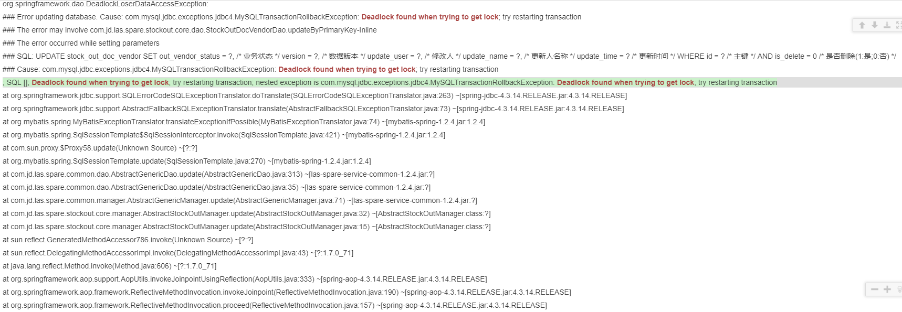
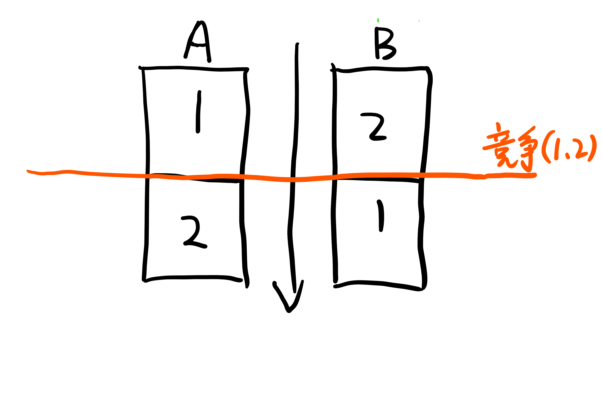
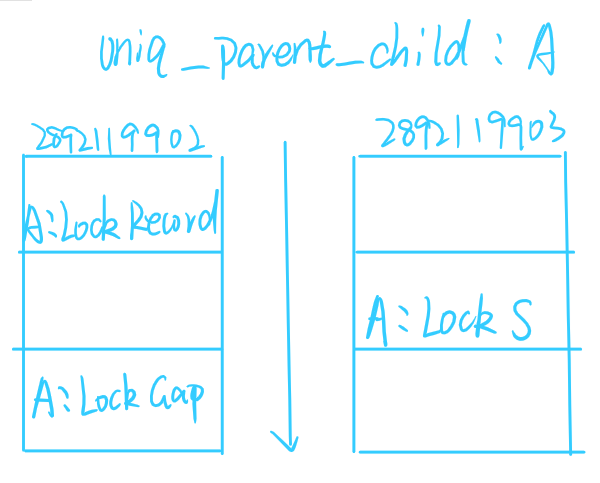

# Dead Lock(基于Innodb 事物隔离级别RR)
## 死锁条件
- 互斥
    - 某个资源在一段时间内只能由一个进程占有，不能同时被两个或两个以上的进程占有
- 不可抢占
    - 进程所获得的资源在未使用完毕之前，资源申请者不能强行地从资源占有者手中夺取资源，而只能由该资源的占有者进程自行释放
- 占有并等待
    - 进程至少已经占有一个资源，但又申请新的资源；由于该资源已被另外进程占有，此时该进程阻塞；但是，它在等待新资源之时，仍继续占用已占有的资源
- 循环等待 
    - 形成一个等待闭环
## Innodb Lock
#### 记录锁（LOCK_REC_NOT_GAP/行级）
锁对象只是单纯的锁在记录上，不会锁记录之前的 `GAP`。在`RC`隔离级别下一般加的都是该类型的记录锁
#### 共享锁（LOCK_S行级）
共享锁的作用通常用于在事务中读取一条行记录后，不希望它被别的事务锁修改，但所有的读请求产生的LOCK_S锁是不冲突的
- 普通查询在隔离级别为`SERIALIZABLE`会给记录加`LOCK_S`
- 类似 `SQL SELECT … IN SHARE MODE`
    - 基于不同的隔离级别，行为有所不同
    - RC隔离级别： `LOCK_REC_NOT_GAP` | `LOCK_S`
    - RR隔离级别：如果查询条件为唯一索引且是唯一等值查询时，加的是 `LOCK_REC_NOT_GAP` | `LOCK_S`
    - 对于非唯一条件查询，或者查询会扫描到多条记录时，加的是`LOCK_ORDINARY` | `LOCK_S`
- `Insert Duplicate Check`
    - 通常INSERT操作是不加锁的，但如果在插入或更新记录时，检查到 `duplicate key`（或者有一个被标记删除的`duplicate key`），对于普通的`INSERT`/`UPDATE`，会加`LOCK_S`
#### 排他锁（LOCK_X/行级)
允许获得排他锁的事务更新数据，阻止其他事务取得相同数据集的共享读锁和排他写锁
- 执行`SQL`（通过二级索引查询）
    - `RC`隔离级别：首先锁住二级索引记录，为`NOT GAP X`锁；然后锁住对应的聚簇索引记录，也是`NOT GAP X`
    - `RR`隔离级别下：首先锁住二级索引记录，为`LOCK_ORDINARY`|`LOCK_X`锁；然后锁住聚簇索引记录，为`NOT GAP X`
- 执行`SQL`（通过聚簇索引检索，更新二级索引数据）
    - 对聚簇索引记录加 `LOCK_REC_NOT_GAP` | `LOCK_X`锁;
    - 在标记删除二级索引时，检查二级索引记录上的锁，如果存在和`LOCK_X` | `LOCK_REC_NOT_GAP`冲突的锁对象，则创建锁对象并返回等待错误码；否则无需创建锁对象；
#### 间隙锁（LOCK_GAP/行级）
表示只锁住一段范围，不锁记录本身，通常表示两个索引记录之间，或者索引上的第一条记录之前，或者最后一条记录之后的锁。可以理解为一种区间锁，一般在RR隔离级别下会使用到`GAP`锁。你可以通过切换到RC隔离级别，或者开启选项`innodb_locks_unsafe_for_binlog`来避免`GAP`锁
#### LOCK_ORDINARY(Next-Key Lock/行级)
MySQL 默认情况下使用`RR`的隔离级别，而`NEXT-KEY LOCK`正是为了解决RR隔离级别下的幻读问题。所谓幻读就是一个事务内执行相同的查询，会看到不同的行记录。
在RR隔离级别下这是不允许的。
#### 插入意向锁（LOCK_INSERT_INTENTION/行级）
`INSERT INTENTION`锁是`GAP`锁的一种，如果有多个`session`插入同一个GAP时，他们无需互相等待，例如当前索引上有记录4和8，两个并发`session`同时插入记录6，7。他们会分别为(4,8)加上`GAP`锁，但相互之间并不冲突（因为插入的记录不冲突）。当向某个数据页中插入一条记录时，总是会进行锁检查（构建索引时的数据插入除外），会去检查当前插入位置的下一条记录上是否存在锁对象，这里的下一条记录不是指的物理连续，而是按照逻辑顺序的下一条记录。 如果下一条记录上不存在锁对象：若记录是二级索引上的，先更新二级索引页上的最大事务ID为当前事务的ID；直接返回成功。如果下一条记录上存在锁对象，就需要判断该锁对象是否锁住了GAP。如果GAP被锁住了，并判定和插入意向GAP锁冲突，当前操作就需要等待，加的锁类型为`LOCK_X` | `LOCK_GAP` | `LOCK_INSERT_INTENTION`，并进入等待状态。但是插入意向锁之间并不互斥
#### 意向 共享锁/排他锁（LOCK_IS/LOCK_IX/表级）
事务打算给数据行加行共享锁/行排他锁，事务在给一个数据行加共享锁前必须先取得该表的`IS`/`IX`锁

## 死锁日志分析
#### 获取数据库死锁日志
`mysql`命令行执行`show engine innodb status`获取日志如下(数据库相关信息删除了敏感信息，可能导致信息不对应)
```sql
    ------------------------
    LATEST DETECTED DEADLOCK
    ------------------------
    180513 18:14:32
    *** (1) TRANSACTION:
    TRANSACTION 5122216139, ACTIVE 0 sec starting index read
    mysql tables in use 3, locked 3
    LOCK WAIT 7 lock struct(s), heap size 1248, 5 row lock(s)
    MySQL thread id 44112901, OS thread handle 139866172294912, query id 28906750093 172.18.109.249 mumu Sending data
    update table1 t1,table2 t2, table3 t3
    set t1.ts=now()
    where t3.yn=1
    and t3.group_no='12345556'

    *** (1) WAITING FOR THIS LOCK TO BE GRANTED:
    RECORD LOCKS space id 382 page no 9156 n bits 104 index `PRIMARY` of table `mumu`.`table1` trx id 5122216139 lock mode S locks rec but not gap waiting
    Record lock, heap no 34 PHYSICAL RECORD: n_fields 39; compact format; info bits 0
    0: len 8; hex 8000000000130e07; asc ;;
    1: len 6; hex 5122216120; asc 1N ;;
      
    *** (2) TRANSACTION:
    TRANSACTION 5122216120, ACTIVE 0 sec starting index read, thread declared inside InnoDB 500
    mysql tables in use 1, locked 1
    56 lock struct(s), heap size 6960, 78 row lock(s), undo log entries 71
    MySQL thread id 44112159, OS thread handle 139866172827392, query id 28906750109 172.18.109.250 wms3_rw Updating
    update table2
    set status=7
    where id =1231232 and yn=1 and status < 7
      
    *** (2) HOLDS THE LOCK(S):
    RECORD LOCKS space id 382 page no 9156 n bits 104 index `PRIMARY` of table `table1`.`column1` trx id 5122216120 lock_mode X locks rec but not gap
    Record lock, heap no 34 PHYSICAL RECORD: n_fields 39; compact format; info bits 0
    0: len 8; hex 8000000000130e07; asc ;;
    1: len 6; hex 5122216120; asc 1N ;;
      
    *** (2) WAITING FOR THIS LOCK TO BE GRANTED:
    RECORD LOCKS space id 516 page no 39 n bits 800 index `idx_dock_no` of table `mumu`.`table2` trx id 1314ED0B8 lock_mode X waiting
    Record lock, heap no 391 PHYSICAL RECORD: n_fields 2; compact format; info bits 0
    0: len 4; hex 38343739; asc 8479;;
    1: len 8; hex 8575; asc ! ;;
      
    *** WE ROLL BACK TRANSACTION (1)
```
#### 死锁日志分析
- `TRANSACTION 5122216139` 根据事物ID的大小 可以判定事物相关代码的执行顺序等相关信息（使用 `select * from information_schema.INNODB_RX`获取事物的详细信息）
- `mysql tables in use 3, locked 3`  表示当前事物使用了三张表且锁了三张表
- `RECORD LOCKS space id 382 page no 9156 n bits 104 index index PRIMARY of table mumu.table1 trx id 5122216139` 表示锁住的资源
- `locks rec but not gap` 表示锁住的是一个索引，而不是一个范围，此处可以看到锁的索引是表`table1`的`PRIMARY`和锁它的锁类型
- `WAITING FOR THIS LOCK TO BE GRANTED`和`HOLDS THE LOCK(S)` 可以看出事物获持有或等待锁的状态分别是等待获取锁和持有当前锁
- `1: len 6; hex 5122216120; asc 1N` 通常`1: len`表示的是当前事物等待锁被占用的事物ID
- `update table2 set status=7  where id =1231232 and yn=1 and status < 7` 日志的事物会有等待或持有锁的sql语句，需要根据语句去判断事物要获取的锁及获取顺序
- 很多时候单从日志并不能完全分析出死锁的具体原因，结合对应的代码逻辑也是很重要的
    
## 案例分析
#### 不同表不同Update造成死锁
- 异常日志


- 原因分析

    - A，B两事物同时执行更新表1，2，顺序分别位A（1，2），B（2，1）
    - 1和2的更新操作都是使用聚簇索引
    - 当执行到竞争线的时候A持有1的主键索引锁，竞争2的主键索引锁，B持有2的主键索引锁，竞争1的主键索引锁，造成死锁
- 解决方案
    - 打破死锁的四个必要条件都可以解决死锁问题，调整程序逻辑，使事物A，B的执行逻辑（更新1，2的顺序）一致，避免循环等待
#### 同表同Insert Sql 造成死锁
- Mysql官方文档对插入问题的描述
```text
    INSERT sets an exclusive lock on the inserted row. This lock is an index-record lock, not a next-key lock (that is, 
    there is no gap lock) and does not prevent other sessions from inserting into the gap before the inserted row.Prior 
    to inserting the row, a type of gap lock called an insertion intention gap lock is set. This lock signals the intent 
    to insert in such a way that multiple transactions inserting into the same index gap need not wait for each other if 
    they are not inserting at the same position within the gap.If a duplicate-key error occurs, a shared lock on the
    duplicate index record is set. This use of a shared lock can result in deadlock should there be multiple sessions 
    trying to insertthe same row if another session already has an exclusive lock.
```
简单来说就是 mysql在插入前不会直接加Lock X，会在插入时做唯一性校验，如果冲突会给两个插入加Lock S
- 异常日志

- 原因分析

    - insert会对插入成功的行加上排它锁，这个排它锁是个记录锁（如图中1 事物2892119902首先加了个 x locks record），不会阻止其他并发的事务往这条记录之前插入记录。<br>
    - 但是插入的字段中存在 `unique`字段索引 `uniq_parent_child,2892119903`在`insert`的时候事物出现了`duplicate-key error`，对`duplicate index record` 加共享锁（
    如图中的2，`uniq_parent_child`所锁升级成为 `lock_mode S`）
    - 然后事物2892119902获取了（如图中3，获取了`lock_mode x locks gap before rec insert`）间隙锁
    - 由于 `Lock record`、`Lock S`、`Lock Gap`按顺序冲突，所以 2等待1释放，3等待2释放，但是1和3是一个事物，造成死锁
    - 事务2892119903 回滚影响最小，所以回滚了事务2892119903  
- 解决方案<br>
    - 以Redis缓存方案，解决这个要并发插入的问题

## 数据库死锁检测机制
#### wait timeout
解决死锁的最简单的一种方式是设置超时时间，即当两个事物互相等待时，当一个事物等待的时间超过某一阀值时，回滚该事物，另一个事物就能顺利进行，在InnoDB存储引擎中可以使用

    innodb_lock_wait_timeout 参数设置超时时间
超时时间相当于根据FIFO顺序来选择回滚的对象，但若超时的事物所占权重比较大，例如实事物操作更新了多行，占用了较多的undo log，这时采用FIFO的方式，就显得很不合适了，因为
回滚这个事物相对于另一个事物所占用的时间会多很多。
#### wait-for graph
除了超时机制，当前数据库还普遍采用 wait-for graph(等待图)的方式来进行死锁检测，较之超时的解决方案，这是一种更为主动的死锁检测方式，InnoDB也采用这种方式，wait-for graph 要求
数据库保存一下两种信息
- 锁的信息链表
- 事物等待链表<br>
通过上述链表可以构造出一张图，而这个图中存在回路，就代表存在死锁。在wait-for graph中，事物为图中节点，而在图中事物T1横向T2的边定义为事物T1等待事物T2所占用的资源或事物T1
等待事物T2将要占用的资源，如下图事物状态和锁信息

根据事物状态和锁信息生成的wait-for graph如下图

wait-for graph 死锁检测通常使用深度优先的算法实现，在InnoDB 1,2版本之前，都是采用递归的方式实现，在1.2版本之后将递归用非递归方式实现，从而提高了InnoDB存储引擎的性能
## 总结
- 精心设计索引，并尽量使用索引访问数据，数据库的更新语句使用主键更新，避免使用非主键索引更新
- 选择合理的事务大小，小事务发生锁冲突的几率也更小
- 尽量使用索引访问数据，尽量用相等条件访问数据，使加锁更精确，这样可以避免间隙锁对并发插入的影响
- 不同的事物访问一组表时，应尽量约定以相同的顺序访问各表，对一个表而言，尽可能以固定的顺序存取表中的行。这样可以大大减少死锁的机会
- 如果满足业务需要尽量使用较低的隔离级别，如果发生了间隙锁，你可以把会话或者事务的事务隔离级别更改为 RC(read committed)级别来避免，但此时需要把 binlog_format 设置成 row 或者 mixed 格式
- 给记录集显示加锁时，最好一次性请求足够级别的锁。比如要修改数据的话，最好直接申请排他锁，而不是先申请共享锁，修改时再请求排他锁，这样容易产生死锁；
```sql
         表锁：LOCK TABLE ...
         行锁：SELECT ... FROM ... WHERE ... FOR UPDATE
```
- 不要申请超过实际需要的锁级别；除非必须，查询时不要显示加锁<br>
- 对于一些特定的事务，可以使用表锁来提高处理速度或减少死锁的可能<br>