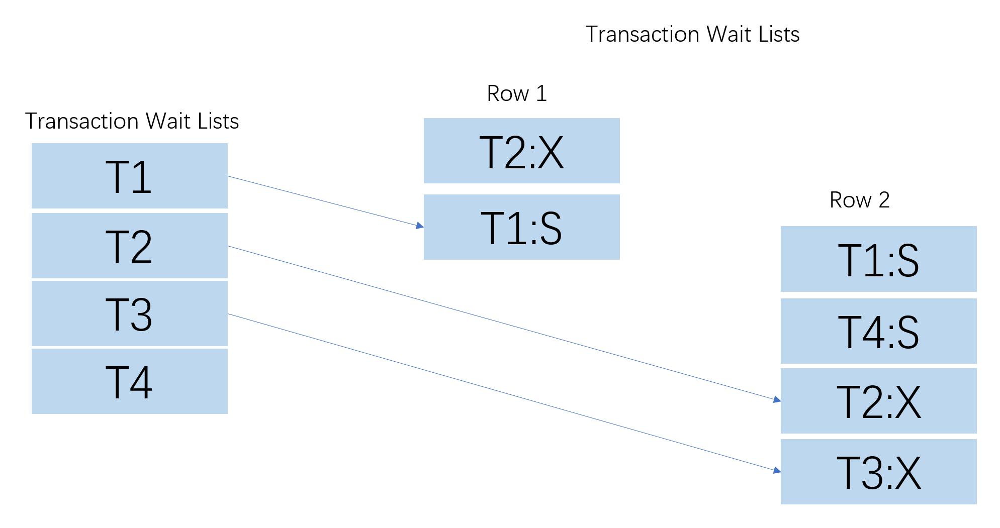

# Deadlock
---
## 一 死锁条件
|条件|描述|
|:-|:-| 
|互斥|某个资源在一段时间内只能由一个进程占有，不能同时被两个或两个以上的进程占有| 
|不可抢占|进程所获得的资源在未使用完毕之前，资源申请者不能强行地从资源占有者手中夺取资源，而只能由该资源的占有者进程自行释放| 
|占有且申请|进程至少已经占有一个资源，但又申请新的资源；由于该资源已被另外进程占有，此时该进程阻塞；但是，它在等待新资源之时，仍继续占用已占有的资源| 
|循环等待|形成一个等待闭环| 
## 二 案例及分析

## 三 死锁日志
### 3.1 获取数据库死锁日志
mysql命令行执行 show engine innodb status

    ------------------------
    LATEST DETECTED DEADLOCK
    ------------------------
    180513 18:14:32
    *** (1) TRANSACTION:
    TRANSACTION 5122216139, ACTIVE 0 sec starting index read
    mysql tables in use 3, locked 3
    LOCK WAIT 7 lock struct(s), heap size 1248, 5 row lock(s)
    MySQL thread id 44112901, OS thread handle 139866172294912, query id 28906750093 172.18.109.249 mumu Sending data
    update table1 t1,table2 t2, table3 t3
    set t1.ts=now()
    where t3.yn=1
    and t3.group_no='12345556'

    *** (1) WAITING FOR THIS LOCK TO BE GRANTED:
    RECORD LOCKS space id 382 page no 9156 n bits 104 index `PRIMARY` of table `mumu`.`table1` trx id 5122216139 lock mode S locks rec but not gap waiting
    Record lock, heap no 34 PHYSICAL RECORD: n_fields 39; compact format; info bits 0
    0: len 8; hex 8000000000130e07; asc ;;
    1: len 6; hex 5122216120; asc 1N ;;
      
    *** (2) TRANSACTION:
    TRANSACTION 5122216120, ACTIVE 0 sec starting index read, thread declared inside InnoDB 500
    mysql tables in use 1, locked 1
    56 lock struct(s), heap size 6960, 78 row lock(s), undo log entries 71
    MySQL thread id 44112159, OS thread handle 139866172827392, query id 28906750109 172.18.109.250 wms3_rw Updating
    update table2
    set status=7
    where id =1231232 and yn=1 and status < 7
      
    *** (2) HOLDS THE LOCK(S):
    RECORD LOCKS space id 382 page no 9156 n bits 104 index `PRIMARY` of table `table1`.`column1` trx id 5122216120 lock_mode X locks rec but not gap
    Record lock, heap no 34 PHYSICAL RECORD: n_fields 39; compact format; info bits 0
    0: len 8; hex 8000000000130e07; asc ;;
    1: len 6; hex 5122216120; asc 1N ;;
      
    *** (2) WAITING FOR THIS LOCK TO BE GRANTED:
    RECORD LOCKS space id 516 page no 39 n bits 800 index `idx_dock_no` of table `mumu`.`table2` trx id 1314ED0B8 lock_mode X waiting
    Record lock, heap no 391 PHYSICAL RECORD: n_fields 2; compact format; info bits 0
    0: len 4; hex 38343739; asc 8479;;
    1: len 8; hex 8575; asc ! ;;
      
    *** WE ROLL BACK TRANSACTION (1)
数据库相关信息删除了敏感信息 可能导致信息不对应
### 3.2 死锁日志分析
|序号|分析过程|
|:-|:-|
|1|TRANSACTION 5122216139，根据事物ID的大小 可以判定事物相关代码的执行顺序等相关信息（使用 select * from information_schema.INNODB_RX\G/获取事物的详细信息）|
|2|mysql tables in use 3, locked 3  表示当前事物使用了三张表且锁了三张表|
|3|RECORD LOCKS space id 382 page no 9156 n bits 104 index index `PRIMARY` of table `mumu`.`table1` trx id 5122216139 lock mode S locks rec but not gap waiting 表示锁住的资源，
   locks rec but not gap 表示锁住的是一个索引，而不是一个范围，此处可以看到锁的索引是表table1的PRIMARY和锁它的锁类型|
|4|WAITING FOR THIS LOCK TO BE GRANTED和HOLDS THE LOCK(S):可以看出事物获持有或等待锁的状态分别是等待获取锁和持有当前锁|
|5|1: len 6; hex 5122216120; asc 1N， 通常1:length表示的是当前事物等待锁被占用的事物ID|
|6|update table2 set status=7  where id =1231232 and yn=1 and status < 7 日志的事物会有等待或持有锁的sql语句，需要根据语句去判断事物要获取的锁
   及获取顺序|
|7|很多时候单从日志并不能完全分析出死锁的具体原因，结合对应的代码逻辑也是很重要的|

## 四 数据库死锁检测机制
### 4.1 wait timeout
解决死锁的最简单的一种方式是设置超时时间，即当两个事物互相等待时，当一个事物等待的时间超过某一阀值时，回滚该事物，另一个事物就能顺利进行，在InnoDB存储引擎中可以使用

    innodb_lock_wait_timeout 参数设置超时时间
超时时间相当于根据FIFO顺序来选择回滚的对象，但若超时的事物所占权重比较大，例如实事物操作更新了多行，占用了较多的undo log，这时采用FIFO的方式，就显得很不合适了，因为
回滚这个事物相对于另一个事物所占用的时间会多很多。
### 4.2 wait-for graph
除了超时机制，当前数据库还普遍采用 wait-for graph(等待图)的方式来进行死锁检测，较之超时的解决方案，这是一种更为主动的死锁检测方式，InnoDB也采用这种方式，wait-for graph 要求
数据库保存一下两种信息

    （1）锁的信息链表
    （2）事物等待链表
通过上述链表可以构造出一张图，而这个图中存在回路，就代表存在死锁。在wait-for graph中，事物为图中节点，而在图中事物T1横向T2的边定义为事物T1等待事物T2所占用的资源或事物T1
等待事物T2将要占用的资源，如下图事物状态和锁信息

根据事物状态和锁信息生成的wait-for graph如下图

wait-for graph 死锁检测通常使用深度优先的算法实现，在InnoDB 1,2版本之前，都是采用递归的方式实现，在1.2版本之后将递归用非递归方式实现，从而提高了InnoDB存储引擎的性能
## 五 总结
〈1〉精心设计索引，并尽量使用索引访问数据，数据库的更新语句使用主键更新，避免使用非主键索引更新 

〈2〉选择合理的事务大小，小事务发生锁冲突的几率也更小 

〈3〉尽量使用索引访问数据，尽量用相等条件访问数据，使加锁更精确，这样可以避免间隙锁对并发插入的影响 

〈4〉不同的事物访问一组表时，应尽量约定以相同的顺序访问各表，对一个表而言，尽可能以固定的顺序存取表中的行。这样可以大大减少死锁的机会 

〈5〉如果满足业务需要尽量使用较低的隔离级别，如果发生了间隙锁，你可以把会话或者事务的事务隔离级别更改为 RC(read committed)级别来避免，但此时需要把 binlog_format 设置成 row 或者 mixed 格式 

〈6〉给记录集显示加锁时，最好一次性请求足够级别的锁。比如要修改数据的话，最好直接申请排他锁，而不是先申请共享锁，修改时再请求排他锁，这样容易产生死锁；

         表锁：LOCK TABLE ...
         行锁：SELECT ... FROM ... WHERE ... FOR UPDATE

〈7〉不要申请超过实际需要的锁级别；除非必须，查询时不要显示加锁 

〈8〉对于一些特定的事务，可以使用表锁来提高处理速度或减少死锁的可能 