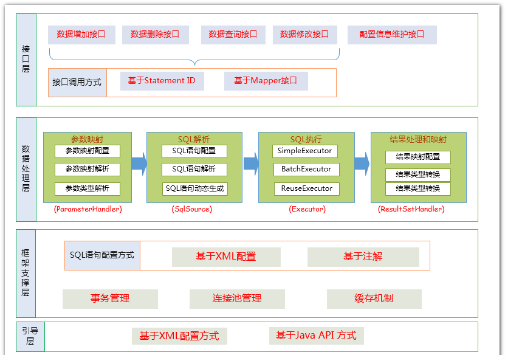

# Mybatis
---



## 一 Mybatis插件
### 1.1 实现原理
拦截四大对象的执行方法，然后重写执行方法最终实现自定义代码嵌入执行流程
- Executor
- StatementHandler
- ParameterHandler
- ResultSetHandler 
### 1.2 Interceptor
```java
public interface Interceptor {

  // mybatis插件重写的核心方法
  Object intercept(Invocation invocation) throws Throwable;
  
  // 生成动态代理对象方法，通常只是串连调用
  Object plugin(Object target);
  
  // mybatis插件在配置时通常需要配置一些参数，这个方法是对参数设置及转换
  void setProperties(Properties properties);
}
```
### 1.3 配置拦截范围
- @Intercepts 

    标记了这是一个Mybatis Interceptor
- @Signature

    ```java
    @Documented
    @Retention(RetentionPolicy.RUNTIME)
    @Target(ElementType.TYPE)
    public @interface Signature {
        // 拦截对象，即上文的四大对象
        Class<?> type();
        // 拦截对象中的方法名
        String method();
        // 方法参数  
        Class<?>[] args();  
        String versionPattern() default VersionUtils.ANY;
    }
- Executor
    ```java
    public interface Executor {
  
        int update(MappedStatement var1, Object var2) throws SQLException;
    
        <E> List<E> query(MappedStatement var1, Object var2, RowBounds var3, ResultHandler var4, CacheKey var5, BoundSql var6) throws SQLException;
    
        <E> List<E> query(MappedStatement var1, Object var2, RowBounds var3, ResultHandler var4) throws SQLException;
        
        ...
    }
    ```
拦截<E> List<E> query(MappedStatement var1, Object var2, RowBounds var3, ResultHandler var4, CacheKey var5, BoundSql var6)方法，
实现如下代码
```java
@Intercepts({
        @Signature(
                type = Executor.class,
                method = "query",
                args = {MappedStatement.class, Object.class, RowBounds.class, ResultHandler.class}),
        @Signature(
                method = "query",
                type = Executor.class,
                args = {MappedStatement.class, Object.class, RowBounds.class, ResultHandler.class, CacheKey.class, BoundSql.class}),
        @Signature(
                type = StatementHandler.class, 
                method = "prepare",
                args = { Connection.class })
})
public class QueryInterceptor implements Interceptor {
    ...
}
```
### 1.4 根据需求重写intercept、plugin、setProperties方法
```java
public class QueryInterceptor implements Interceptor {
    
    public Object intercept(Invocation invocation) throws Throwable {
        return invocation.proceed();
    }

    public Object plugin(Object o) {
        return Plugin.wrap(target, this);
    }

    public void setProperties(Properties properties) {

    }
}
```
只是嵌套实现，并未真正重写
