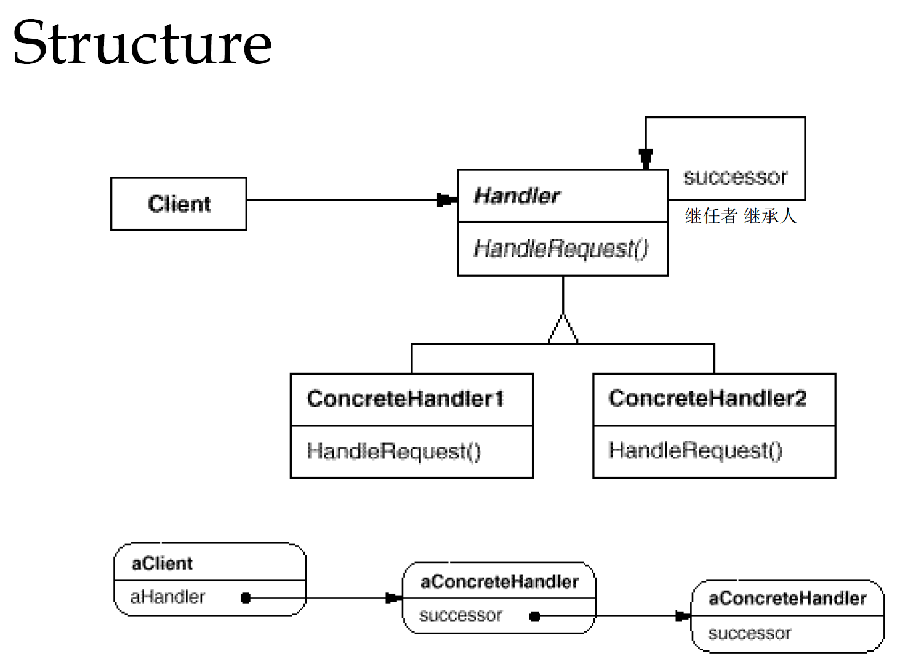

# Chain of Responsibility
---
### 在责任链模式里，很多对象由每一个对象对下家的引用而链接起来形成一条链，请求在这链上传递，直到链上的摸一个对象决定处理此请求，发出请求的客户端并不知道链上的哪个对象最终处理这个请求，这使得系统可以在不影响客户端的情况下动态地重新组织链和分配责任

### 以druid为例介绍
- druid的属性文件druid-filter.properties
    ```properties
    druid.filters.default=com.alibaba.druid.filter.stat.StatFilter
    druid.filters.stat=com.alibaba.druid.filter.stat.StatFilter
    druid.filters.mergeStat=com.alibaba.druid.filter.stat.MergeStatFilter
    druid.filters.counter=com.alibaba.druid.filter.stat.StatFilter
    druid.filters.encoding=com.alibaba.druid.filter.encoding.EncodingConvertFilter
    druid.filters.log4j=com.alibaba.druid.filter.logging.Log4jFilter
    druid.filters.log4j2=com.alibaba.druid.filter.logging.Log4j2Filter
    druid.filters.slf4j=com.alibaba.druid.filter.logging.Slf4jLogFilter
    druid.filters.commonlogging=com.alibaba.druid.filter.logging.CommonsLogFilter
    druid.filters.commonLogging=com.alibaba.druid.filter.logging.CommonsLogFilter
    druid.filters.wall=com.alibaba.druid.wall.WallFilter
    druid.filters.config=com.alibaba.druid.filter.config.ConfigFilter
    ```
    所有配置文件中的实现类都直接或间接继承FilterAdapter，FilterAdapter实现Filter接口
- Filter 
    ```java
    public interface Filter extends Wrapper {

        void init(DataSourceProxy dataSource);

        void destroy();

        void configFromProperties(Properties properties);

        boolean isWrapperFor(java.lang.Class<?> iface);

        <T> T unwrap(java.lang.Class<T> iface);

        ConnectionProxy connection_connect(FilterChain chain, Properties info) throws SQLException;

        StatementProxy connection_createStatement(FilterChain chain, ConnectionProxy connection) throws SQLException;

        PreparedStatementProxy connection_prepareStatement(FilterChain chain, ConnectionProxy connection, String sql) throws SQLException;

        ...
    }
    ```
    Filter定义了druid的基础方法
- FilterAdapter
    ```java
    public abstract class FilterAdapter extends NotificationBroadcasterSupport implements Filter {

    @Override
    public void init(DataSourceProxy dataSource) {
    }

    @Override
    public void destroy() {

    }

    public void configFromProperties(Properties properties) {

    }

    @Override
    public boolean isWrapperFor(Class<?> iface) {
        return iface == this.getClass();
    }

    @Override
    public ConnectionProxy connection_connect(FilterChain chain, Properties info) throws SQLException {
        return chain.connection_connect(info);
    }
    @Override
    public StatementProxy connection_createStatement(FilterChain chain, ConnectionProxy connection) throws SQLException {
        return chain.connection_createStatement(connection);
    }

    @Override
    public StatementProxy connection_createStatement(FilterChain chain, ConnectionProxy connection, int resultSetType,
                                                     int resultSetConcurrency) throws SQLException {
        return chain.connection_createStatement(connection, resultSetType, resultSetConcurrency);
    }

    @Override
    public StatementProxy connection_createStatement(FilterChain chain, ConnectionProxy connection, int resultSetType,
                                                     int resultSetConcurrency, int resultSetHoldability)
                                                                                                        throws SQLException {
        return chain.connection_createStatement(connection, resultSetType, resultSetConcurrency, resultSetHoldability);
    }
        @Override
    public PreparedStatementProxy connection_prepareStatement(FilterChain chain, ConnectionProxy connection, String sql)
                                                                                                                        throws SQLException {
        return chain.connection_prepareStatement(connection, sql);
    }

    @Override
    public PreparedStatementProxy connection_prepareStatement(FilterChain chain, ConnectionProxy connection,
                                                              String sql, int autoGeneratedKeys) throws SQLException {
        return chain.connection_prepareStatement(connection, sql, autoGeneratedKeys);
    }

    @Override
    public PreparedStatementProxy connection_prepareStatement(FilterChain chain, ConnectionProxy connection,
                                                              String sql, int resultSetType, int resultSetConcurrency)
                                                                                                                      throws SQLException {
        return chain.connection_prepareStatement(connection, sql, resultSetType, resultSetConcurrency);
    }

    @Override
    public PreparedStatementProxy connection_prepareStatement(FilterChain chain, ConnectionProxy connection,
                                                              String sql, int resultSetType, int resultSetConcurrency,
                                                              int resultSetHoldability) throws SQLException {
        return chain.connection_prepareStatement(connection, sql, resultSetType, resultSetConcurrency,
                                                 resultSetHoldability);
    }

    @Override
    public PreparedStatementProxy connection_prepareStatement(FilterChain chain, ConnectionProxy connection,
                                                              String sql, int[] columnIndexes) throws SQLException {
        return chain.connection_prepareStatement(connection, sql, columnIndexes);
    }

    @Override
    public PreparedStatementProxy connection_prepareStatement(FilterChain chain, ConnectionProxy connection,
                                                              String sql, String[] columnNames) throws SQLException {
        return chain.connection_prepareStatement(connection, sql, columnNames);
    }
    ```
    FilterAdapter所有的方法实现都是基于FilterChain的调用
- FilterAdapter的一个子类实现WallFilter的对connection_prepareStatement的重写
    ```java
    @Override
    public PreparedStatementProxy connection_prepareStatement(FilterChain chain, ConnectionProxy connection, String sql)
                                                                                                                        throws SQLException {
        String dbType = connection.getDirectDataSource().getDbType();
        WallContext context = WallContext.create(dbType);
        try {
            WallCheckResult result = checkInternal(sql);
            context.setWallUpdateCheckItems(result.getUpdateCheckItems());
            sql = result.getSql();
            PreparedStatementProxy stmt = chain.connection_prepareStatement(connection, sql);
            setSqlStatAttribute(stmt);
            return stmt;
        } finally {
            WallContext.clearContext();
        }
    }
    ```
    FilterAdapter的所有子类在复写责任链方法时，都会回调责任链方法(`chain.connection_prepareStatement(connection, sql)`)。保证整体逻辑是基于
    责任链模式串联，同时基于配置Filter的方式实现业务串联，各子模块实现解耦，实现组件化配置。
