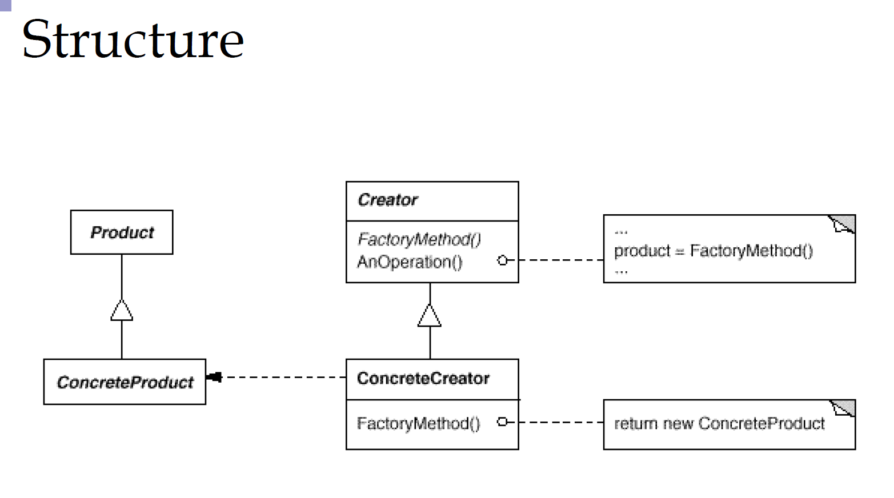

# Factory Method
在工厂方法模式中，工厂父类负责定义创建产品对象的公共接口，而工厂子类则负责生成具体的产品对象，这样做的目的是将产品类的实例化操作延迟到工厂子类中完成，即通过工厂子类来确定究竟应该实例化哪一个具体产品类。

### 以Lombok中的@Builder注解为例介绍
- 实体类
    ```java
    @Builder
    public class Student {
        private String name;
        private Integer age;
        private String schoolName;
        private Integer sex;
    }
    ```
- 编译后
    ```java
    public class Student {
        private String name;
        private Integer age;
        private String schoolName;
        private Integer sex;

        Student(String name, Integer age, String schoolName, Integer sex) {
            this.name = name;
            this.age = age;
            this.schoolName = schoolName;
            this.sex = sex;
        }

        public static Student.StudentBuilder builder() {
            return new Student.StudentBuilder();
        }

        public static class StudentBuilder {
            private String name;
            private Integer age;
            private String schoolName;
            private Integer sex;

            StudentBuilder() {
            }

            public Student.StudentBuilder name(String name) {
                this.name = name;
                return this;
            }

            public Student.StudentBuilder age(Integer age) {
                this.age = age;
                return this;
            }

            public Student.StudentBuilder schoolName(String schoolName) {
                this.schoolName = schoolName;
                return this;
            }

            public Student.StudentBuilder sex(Integer sex) {
                this.sex = sex;
                return this;
            }

            public Student build() {
                return new Student(this.name, this.age, this.schoolName, this.sex);
            }
        }
    }
    ```
- 使用
    ```java
    public static void main(String[] args) {
        Student mumu = Student.builder()
                .age(12)
                .name("mumu")
                .schoolName("Tsinghua")
                .sex(0)
                .build();
    }
    ```
