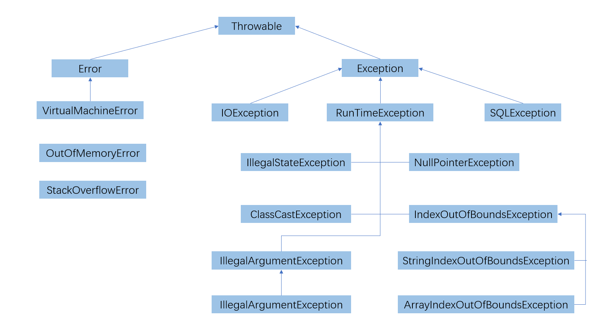

# 异常
---
## 一 异常介绍

## 二 异常处理方式
### 2.1 throw
    
        public static Statement parse(String sql) throws JSQLParserException {
            CCJSqlParser parser = new CCJSqlParser(new StringProvider(sql));
            parser.Statement();
        }
    
### 2.2 try catch
    
        try {
            saveReadWriteRecord(dmlRecord);
            saveIndexRecord(dmlRecord);
        } catch (JSQLParserException e) {
            log.error("dmlRecord:{},Sql Parser Exception", JSON.toJSONString(dmlRecord), e);
            saveDmlRecordHandleResult(dmlRecord, DmlRecordStatusEnum.FAIL_PARSER_SQL.getCode());
        } catch (Exception e) {
            log.error("dmlRecord:{},save indexRecord Exception", JSON.toJSONString(dmlRecord), e);
            saveDmlRecordHandleResult(dmlRecord, DmlRecordStatusEnum.FAIL_SAVE_INDEX_RECORD.getCode());
        }

## 三 使用异常的不良习惯
### 3.1 捕获异常 但不对做有意义的处理    
    catch (......) {
        e.printStackTrace();
    }
### 3.2 catch Exception(提供接口 补全错误码等情况 除外)
    catch (Exception ex) {
        ...
    }
尽可能制定具体异常类型，必要时使用多个catch
### 3.3 占用的资源不释放(如果程序中用到了File/Socket/JDBC等资源)
    FileOutputStream fop = null;
    File file;
    try {
         file = new File(pathName);
         fop = new FileOutputStream(file);
         // if file doesnt exists, then create it
         if (!file.exists()) {
              file.createNewFile();
         }
         // get the content in bytes
         byte[] contentInBytes = content.getBytes();
         fop.write(contentInBytes);
         fop.flush();
         fop.close();
    } catch (IOException e) {
         e.printStackTrace();
    } 
### 3.4 不记录异常的详细信息或使用e.printStackTrace()打印
    catch (NullPointerException ex) {
        // 不记录异常的堆栈日志
    }
    
    // 如下代码 printStackTrace() 使用同步锁 锁PrintStream 使用log记录异常栈信息 
    public void printStackTrace() {
        printStackTrace(System.err);
    }
    
    public void printStackTrace(PrintStream s) {
        printStackTrace(new WrappedPrintStream(s));
    }    
    
    private void printStackTrace(PrintStreamOrWriter s) {
        // Guard against malicious overrides of Throwable.equals by
        // using a Set with identity equality semantics.
        Set<Throwable> dejaVu =
            Collections.newSetFromMap(new IdentityHashMap<Throwable, Boolean>());
        dejaVu.add(this);

        synchronized (s.lock()) {
            // Print our stack trace
            s.println(this);
            StackTraceElement[] trace = getOurStackTrace();
            for (StackTraceElement traceElement : trace)
                s.println("\tat " + traceElement);

            // Print suppressed exceptions, if any
            for (Throwable se : getSuppressed())
                se.printEnclosedStackTrace(s, trace, SUPPRESSED_CAPTION, "\t", dejaVu);

            // Print cause, if any
            Throwable ourCause = getCause();
            if (ourCause != null)
                ourCause.printEnclosedStackTrace(s, trace, CAUSE_CAPTION, "", dejaVu);
        }
    }
### 3.5 把大量的语句装进单个巨大的try块
### 3.6 使用异常导致数据不一致或不完整
例如 在循环中发生异常(若保证一致性 需要回滚逻辑)
## 四 开源框架中的异常处理
### 4.1 事物xml/注解
#### 4.1.1 以配置文件实现事物管理
        <bean id="transactionManager" class="org.springframework.transaction.jta.JtaTransactionManager" /> 
        <tx:advice id="txAdvice">
            <tx:attributes>
                <tx:method name="get*" read-only="true"/>
                <tx:method name="*"/>
            </tx:attributes>
        </tx:advice>
        <aop:config>
            <aop:pointcut id="mybatisOperation" expression="execution(* com.mumu.*.query.*.*(..))"/>
            <aop:advisor advice-ref="txAdvice" pointcut-ref="mybatisOperation"/>
        </aop:config>
#### 4.1.2 用注解来实现事务管理 
    <x:annotation-driven transaction-manager="transactionManager"/>
    
    @Transactional(rollbackFor = Exception.class)
    public List<String> findTablesFromDataSource(IndexEyeDataSource dataSource) {
        return commonMapper.findTablesFromDataSource();
    }    

### 4.2 springMVC异常信息国际化
采用在BaseController中 使用@ExceptionHandler国际化方案

    @ExceptionHandler(Exception.class)
    @ResponseStatus(value = HttpStatus.INTERNAL_SERVER_ERROR)
    public ModelAndView ModelAndViewExceptionHandle(Exception ex, HttpServletRequest request) {
        ModelAndView modelAndView = new ModelAndView();
        if(ex instanceof BusinessException) {
            modelAndView.setViewName("error-business");
        }else if(ex instanceof ParameterException) {
            modelAndView.setViewName("error-parameter");
        } else {
            modelAndView.setViewName("error");
        }
        modelAndView.addObject("error", getExceptionMessage(ex, request));
        return modelAndView;
    }

    private String getExceptionMessage(Exception ex, HttpServletRequest request) {
        // 根据本地语言 国际化异常信息
        return "exception";
    }
    
## 五 性能损耗Throwable.fillInStackTrace
 
    // 由于异常的父类都是 Throwable 在创建异常时需要初始化异常栈
    public Throwable() {
        fillInStackTrace();
    }
    // 创建异常栈方法是同步的
    public synchronized Throwable fillInStackTrace() {
        if (stackTrace != null ||
            backtrace != null /* Out of protocol state */ ) {
            fillInStackTrace(0);
            stackTrace = UNASSIGNED_STACK;
        }
        return this;
    }
    // 存入当前线程的堆栈信息,也就是说每次创建一个异常实例都会把堆栈信息存一遍。时间开销很大
    private native Throwable fillInStackTrace(int dummy);
    
如果代码整体逻辑如下代码

    try {
        try {
            // (1) do something
        } catch (Exception e) {
            // (2) 记录日志
            throw new CustomRuntimeException();
        }
    } catch (CustomRuntimeException cre) {
        // (3) handle exception
    }
如果(2 -> 3) 过程中不需要通过异常控制事物回滚 则不要使用new CustomRuntimeException（以异常码的方式代替实现）减少新建异常对性能的消耗

## 六 使用自定义RuntimeException

    public class MumuException extends RuntimeException {    
        public MumuException(String message){
            super(message);
        }
    }
    
如果异常定义清晰 足已定位代码 建议重写fillInStackTrace()减少不必要的性能损耗
