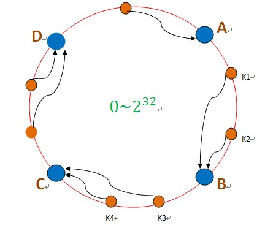
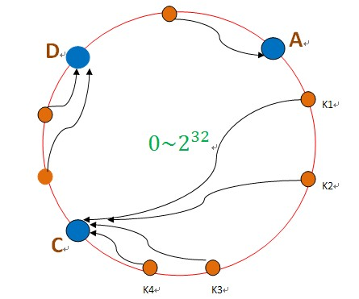

# Hash
---
## 一 哈希算法
### 1.1 MurmurHash
MurmurHash 是一种非加密型哈希函数，适用于一般的哈希检索操作，速度很快，实现了32位（低延时）、128位HashKey，尤其对大块的数据，具有较高的平衡性与低碰撞率。。在Redis中应用十分广泛，包括数据库、集群、哈希键、阻塞操作等功能都用到了这个算法。

    unsigned int murMurHash(const void *key, int len) {
        const unsigned int m = 0x5bd1e995;
        const int r = 24;
        const int seed = 97;
        unsigned int h = seed ^ len;
        // Mix 4 bytes at a time into the hash
        const unsigned char *data = (const unsigned char *)key;
        while(len >= 4) {
            unsigned int k = *(unsigned int *)data;
            k *= m; 
            k ^= k >> r; 
            k *= m; 
            h *= m; 
            h ^= k;
            data += 4;
            len -= 4;
        }
        
        // Handle the last few bytes of the input array
        switch(len) {
            case 3: h ^= data[2] << 16;
            case 2: h ^= data[1] << 8;
            case 1: h ^= data[0];
            h *= m;
        };
        
        // Do a few final mixes of the hash to ensure the last few
        // bytes are well-incorporated.
        h ^= h >> 13;
        h *= m;
        h ^= h >> 15;
        return h;
    }
### 1.2 MD5
MD5是Rivest于1991年对MD4的改进版本。它对输入仍以512位分组，其输出是128位。MD5比MD4复杂，并且计算速度要慢一点，更安全一些。MD5 已被证明不具备”强抗碰撞性”
### 1.3 一致性hash算法
一致性哈希算法是分布式系统中常用的算法。一个分布式的存储系统，要将数据存储到具体的节点上，如果采用普通的hash方法，将数据映射到具体的节点上，如key%N，key是数据的key，N是机器节点数，如果有一个机器加入或退出这个集群，则所有的数据映射都无效了，如果是持久化存储则要做数据迁移，如果是分布式缓存，则其他缓存就失效了。
 
把数据用hash函数（如MD5），映射到一个很大的空间里，如图所示。数据的存储时，先得到一个hash值，对应到这个环中的每个位置，如k1对应到了图中所示的位置，然后沿顺时针找到一个机器节点B，将k1存储到B这个节点中。
如果B节点宕机了，则B上的数据就会落到C节点上，如下图所示
 
这样，只会影响C节点，对其他的节点A，D的数据不会造成影响。然而，这又会造成一个“雪崩”的情况，即C节点由于承担了B节点的数据，所以C节点的负载会变高，C节点很容易也宕机，这样依次下去，这样造成整个集群都挂了。
为此，引入了“虚拟节点”的概念：即把想象在这个环上有很多“虚拟节点”，数据的存储是沿着环的顺时针方向找一个虚拟节点，每个虚拟节点都会关联到一个真实节点，如下图所使用
 
图中的A1、A2、B1、B2、C1、C2、D1、D2都是虚拟节点，机器A负载存储A1、A2的数据，机器B负载存储B1、B2的数据，机器C负载存储C1、C2的数据。由于这些虚拟节点数量很多，均匀分布，因此不会造成“雪崩”现象。

## 二 哈希冲突解决方法
### 1.1 开放定址法（再散列法）
当关键字key的哈希地址p=H（key）出现冲突时，以p为基础，产生另一个哈希地址p1，如果p1仍然冲突，再以p为基础，产生另一个哈希地址p2，…，直到找出一个不冲突的哈希地址pi
### 1.2 再哈希法
同时构造多个不同的哈希函数：

    Hi=RH1（key）  i=1，2，…，k
当哈希地址Hi=RH1（key）发生冲突时，再计算Hi=RH2（key）……，直到冲突不再产生。这种方法不易产生聚集，但增加了计算时间
### 1.3 链地址法
将所有哈希地址为i的元素构成一个称为同义词链的单链表，并将单链表的头指针存在哈希表的第i个单元中，因而查找、插入和删除主要在同义词链中进行。链地址法适用于经常进行插入和删除的情况。
JDK中的链表是使用链地址法实现，且在1.8版本中，当链表长度大于8时，会转换成红黑树结构

### 1.4 建立公共溢出区
将哈希表分为基本表和溢出表两部分，凡是和基本表发生冲突的元素，一律填入溢出表