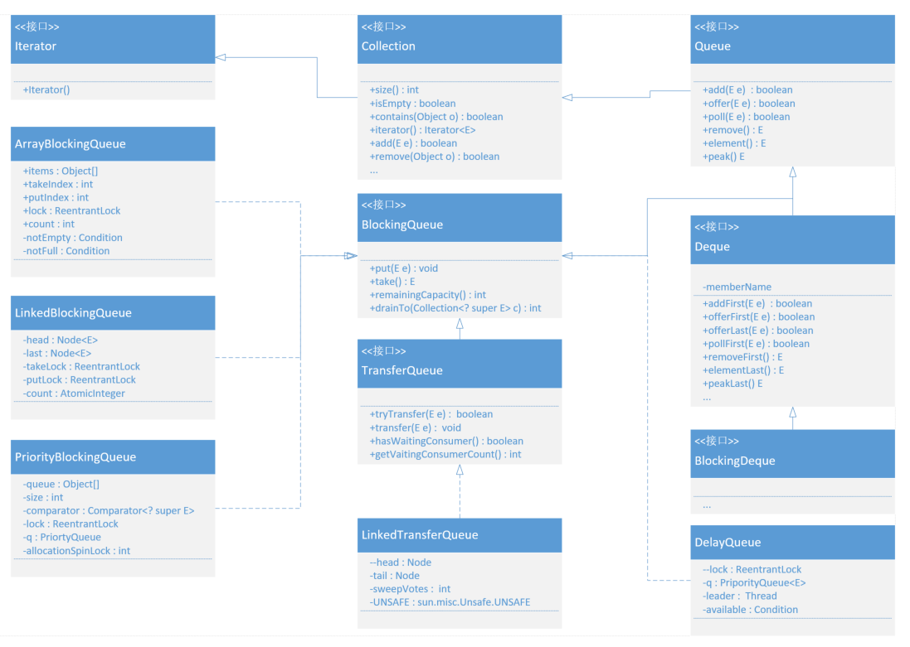

# 队列
---
## 一 java内置队列
|队列|有界性|锁|数据结构|
|:-|:-|:-|:-|
|ArrayBlockingQueue|bounded|加锁|arrayList|
|LinkedBlockingQueue|optionally-bounded(在不指定时容量为Integer.MAX_VALUE,可以指定容量)|加锁|linkedList|
|PriorityQueue|unbounded|无锁|heap|
|DelayQueue|unbounded|无锁|heap|
|PriorityBlockingQueue|unbounded(一个由优先级堆支持的无界优先级队列)|无锁|heap|
|SynchronousQueue|bounded(1) 没有缓冲区，生产者和消费者互相等待对方，握手，然后一起离开|加锁|无|
|LinkedTransferQueue|unbounded|无锁|linkedList|
|ConcurrentLinkedQueue|unbounded|无锁|linkedList|

## 二 阻塞队列

### 2.1 SynchronousQueue 
#### 2.1.1 SynchronousQueue介绍
SynchronousQueue，实际上它不是一个真正意义的队列，因为它不会为队列中元素维护存储空间。与其他队列不同的是，它维护一组线程，这些线程在等待着把元素加入或移出队列， 它阻塞的是加入和移出的线程操作
    
        // 公平模式和不公平模式
        public SynchronousQueue(boolean fair) {
            transferer = fair ? new TransferQueue() : new TransferStack();
        }
        
        // 一个节点即是头节点也是尾节点
        TransferQueue() {
            QNode h = new QNode(null, false); // initialize to dummy node.
            head = h;
            tail = h;
        }
        
        /** Dual stack */
        static final class TransferStack extends Transferer {

            /* Modes for SNodes, ORed together in node fields */
            /** Node represents an unfulfilled consumer */
            static final int REQUEST    = 0;
            /** Node represents an unfulfilled producer */
            static final int DATA       = 1;
            /** Node is fulfilling another unfulfilled DATA or REQUEST */
            static final int FULFILLING = 2;
        
            /** Return true if m has fulfilling bit set */
            static boolean isFulfilling(int m) { return (m & FULFILLING) != 0; }
        
            /** Node class for TransferStacks. */
            static final class SNode {
                volatile SNode next;        // next node in stack
                volatile SNode match;       // the node matched to this
                volatile Thread waiter;     // to control park/unpark
                Object item;                // data; or null for REQUESTs
                int mode;
                // Note: item and mode fields don't need to be volatile
                // since they are always written before, and read after,
                // other volatile/atomic operations.
        
                SNode(Object item) {
                    this.item = item;
                }
        
                boolean casNext(SNode cmp, SNode val) {
                    return cmp == next &&
                        UNSAFE.compareAndSwapObject(this, nextOffset, cmp, val);
                }
            }
        }
        
#### 2.1.2 SynchronousQueue 在线程池中的应用
Executors.newCachedThreadPool()就使用了SynchronousQueue，这个线程池根据需要（新任务到来时）创建新的线程，如果有空闲线程则会重复使用，线程空闲了60秒后会被回收
    
    // 创建newCachedThreadPool线程池使用的消息队列是：SynchronousQueue
    ExecutorService executorService = Executors.newCachedThreadPool();
    // 实现如下
    public static ExecutorService newCachedThreadPool() {
        return new ThreadPoolExecutor(0, Integer.MAX_VALUE, 60L, TimeUnit.SECONDS, new SynchronousQueue<Runnable>());
    }
    
### 2.2 LinkedBlockingQueue
    // LinkedBlockingQueue:线程池Executors的newFixedThreadPool和newSingleThreadExecutor的工作队列
    public static BlockingQueue<Runnable> buildQueue(int size, boolean isPriority) {
        Object queue;
        if (size == 0) {
        	queue = new SynchronousQueue();  
        } else if (isPriority) {       
        	queue = size < 0 ? new PriorityBlockingQueue() : new PriorityBlockingQueue(size);    
        } else {   
        	queue = size < 0 ? new LinkedBlockingQueue() : new LinkedBlockingQueue(size);
        }
        return (BlockingQueue)queue;
    }
    
### 2.3 ArrayBlockingQueued
 
 如上图ArrayBlockingQueued的生产-消费过程，ArrayBlockingQueue的读写是不同步的，读会修改takeIndex，写会改putIndex 
### 2.4 LinkedTransferQueue
#### 2.4.1 LinkedTransferQueue 实现 TransferQueue 接口
TransferQueue接口方法

    // 若当前存在一个正在等待获取的消费者线程，即立刻移交之；否则，会插入当前元素e到队列尾部，并且等待进入阻塞状态，到有消费者线程取走该元素
    transfer(E e);
    // 若当前存在一个正在等待获取的消费者线程（使用take()或者poll()函数），使用该方法会即刻转移/传输对象元素e；若不存在，则返回false，并且不进入队列。这是一个不阻塞的操作
    tryTransfer(E e);
    // 若当前存在一个正在等待获取的消费者线程，会立即传输给它;否则将插入元素e到队列尾部，并且等待被消费者线程获取消费掉；若在指定的时间内元素e无法被消费者线程获取，则返回false，同时该元素被移除。
    tryTransfer(E e, long timeout, TimeUnit unit);
    // 判断是否存在消费者线程
    hasWaitingConsumer();
    // 获取所有等待获取元素的消费线程数量
    getWaitingConsumerCount();
    // 因为队列的异步特性，检测当前队列的元素个数需要逐一迭代，可能会得到一个不太准确的结果，尤其是在遍历时有可能队列发生更改
    size()
    
#### 2.4.2 transfer算法    
transfer算法比较复杂，大致的理解是采用所谓双重数据结构(dual data structures)。之所以叫双重，其原因是方法都是通过两个步骤完成：保留与完成。比如消费者线程从一个队列中取元素，发现队列为空，他就生成一个空元素放入队列,所谓空元素就是数据项字段为空。然后消费者线程在这个字段上旅转等待。这叫保留。直到一个生产者线程意欲向队例中放入一个元素，这里他发现最前面的元素的数据项字段为NULL，他就直接把自已数据填充到这个元素中，即完成了元素的传送。
#### 2.4.3 注意事项
|注意事项|
|:-|
|(1)无论是transfer还是tryTransfer方法，在>=1个消费者线程等待获取元素时（此时队列为空），都会立刻转交，这属于线程之间的元素交换。注意，这时，元素并没有进入队列|
|(2)在队列中已有数据情况下，transfer将需要等待前面数据被消费掉，直到传递的元素e被消费线程取走为止|
|(3)使用transfer方法，工作者线程可能会被阻塞到生产的元素被消费掉为止|
|(4)消费者线程等待为零的情况下，各自的处理元素入队与否情况有所不同|
|(5)size()方法，需要迭代，可能不太准确，尽量不要调用|

## 三 非阻塞队列
### 3.1 ConcurrentLinkedQueue

### 3.2 环形队列
#### 3.2.1 环形队列优点
|优点|描述|
|:-|:-|
|保证元素是先进先出的|是由队列的性质保证的，在环形队列中通过对队列的顺序访问保证|
|元素空间可以重复利用|因为一般的环形队列都是一个元素数固定的一个闭环，可以在环形队列初始化的时候分配好确定的内存空间，当进队或出队时只需要返回指定元素内存空间的地址即可，这些内存空间可以重复利用，避免频繁内存分配和释放的开销|
|为多线程数据通信提供了一种高效的机制|在最典型的生产者消费者模型中，如果引入环形队列，那么生成者只需要生成“东西”然后放到环形队列中即可，而消费者只需要从环形队列里取“东西”并且消费即可，没有任何锁或者等待，巧妙的高效实现了多线程数据通信|
#### 3.2.2 无锁环形队列的实现

|实现方式|描述|
|:-|:-|
|环形队列的存储结构|链表和线性表都是可以的，但几乎都用线性表实现，比链表快很多，原因也是显而易见的，因为访问链表需要挨个遍历|
|读写index|有2个index很重要，一个是写入index，标示了当前可以写入元素的index，入队时使用。一个是读取index，标示了当前可以读取元素的index，出队时使用|
|元素状态切换|有种很巧妙的方法，就是在队列中每个元素的头部加一个元素标示字段，标示这个元素是可读还是可写，而这个的关键就在于何时设置元素的可读可写状态，参照linux内核实现原理，当这个元素读取完之后，要设置可写状态，当这个元素写入完成之后，要设置可读状态|
