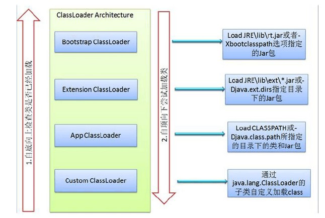

# ClassLoader
---
## 一 类加载器

## 二 类加载过程
## 2.1 加载过程(go语言描述)
    /**
     * 类加载器 加载流程
     * 如果用户没有提供 -classpath/-cp选项，则使用当前的目录作为用户路径
     */
    func Parse(jreOption, cpOption string) *Classpath {
        cp := &Classpath{}
        cp.parseBootAndExtClasspath(jreOption)
        cp.parseUserClasspath(cpOption)
        return cp
    }
    
    /**
     * 加载bootClasspath和extClasspath
     */
    func (self *Classpath) parseBootAndExtClasspath(jreOption string) {
    	jreDir := getJreDir(jreOption)
    	// jre/lib/*
    	jreLibPath := filepath.Join(jreDir, "lib", "*")
    	self.bootClasspath = newWildcardEntry(jreLibPath)
    	// jre/lib/ext/*
    	jreExtPath := filepath.Join(jreDir, "lib", "ext", "*")
    	self.extClasspath = newWildcardEntry(jreExtPath)
    }
    
    /**
     * 加载 userClasspath
     */
    func (self *Classpath) parseUserClasspath(cpOption string) {
    	if cpOption == "" {
    		cpOption = "."
    	}
    	self.userClasspath = newEntry(cpOption)
    }
## 2.2 类加载器双亲委派代码(jdk的类加载器源码)

    protected Class<?> loadClass(String name, boolean resolve)
            throws ClassNotFoundException
        {
            synchronized (getClassLoadingLock(name)) {
                // First, check if the class has already been loaded
                Class<?> c = findLoadedClass(name);
                if (c == null) {
                    long t0 = System.nanoTime();
                    try {
                        if (parent != null) {
                            c = parent.loadClass(name, false);
                        } else {
                            c = findBootstrapClassOrNull(name);
                        }
                    } catch (ClassNotFoundException e) {
                        // ClassNotFoundException thrown if class not found
                        // from the non-null parent class loader
                    }
    
                    if (c == null) {
                        // If still not found, then invoke findClass in order
                        // to find the class.
                        long t1 = System.nanoTime();
                        c = findClass(name);
    
                        // this is the defining class loader; record the stats
                        sun.misc.PerfCounter.getParentDelegationTime().addTime(t1 - t0);
                        sun.misc.PerfCounter.getFindClassTime().addElapsedTimeFrom(t1);
                        sun.misc.PerfCounter.getFindClasses().increment();
                    }
                }
                if (resolve) {
                    resolveClass(c);
                }
                return c;
            }
        }
    }
## 三 Custom ClassLoader
### 实现ClassLoader
自定义不打破双亲委派机制的类加载器，只重写findClass方法

    public class MumuClassLoader extends ClassLoader {
    
        @Override
        protected Class<?> findClass(String name) throws ClassNotFoundException {
            byte [] byteCode = getBytes(name);
            if(null != byteCode){
                //字节码转化为类
                return defineClass(name, byteCode,0, byteCode.length);
            }
            return super.findClass(name);
        }
    }