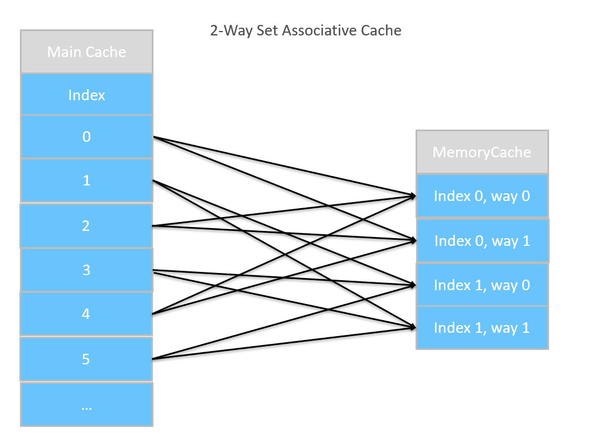
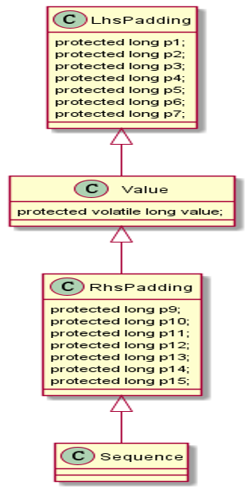
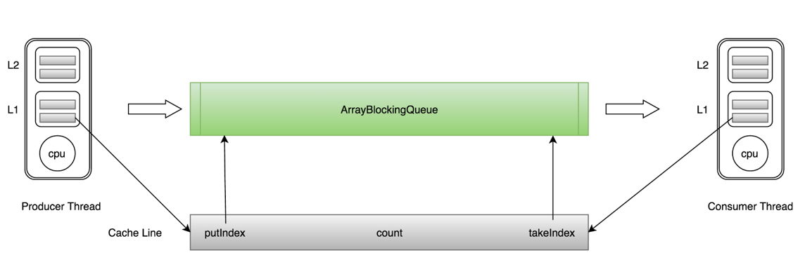

# 队列
---
## 一 java内置队列
|队列|有界性|锁|数据结构|
|:-|:-|:-|:-|
|ArrayBlockingQueue|bounded|加锁|arrayList|
|LinkedBlockedQueue|optionally-bounded|加锁|linkedList|
|ConcurrentLinkedQueue|unbounded|无锁|linkedList|
|LinkedTransferQueue|unbounded|无锁|linkedList|
|PriorityBlockingQueue|unbounded|无锁|linkedList|
|DelayQueue|unbounded|无锁|linkedList|
## 二 阻塞队列
## 三 非阻塞队列
## 四 伪共享
### 4.2 什么是伪共享
CPU缓存系统中是以缓存行（cache line）为单位存储的。目前主流的CPU Cache的Cache Line大小都是64Bytes。
在多线程情况下，如果需要修改“共享同一个缓存行的变量”，就会无意中影响彼此的性能，这就是伪共享（False Sharing）。
### 4.2 cpu三级缓存结构 
由于CPU的速度远远大于内存速度，所以CPU设计者们就给CPU加上了缓存(CPU Cache)。 以免运算被内存速度拖累。（就像我们写代码把共享数据做Cache不想被DB存取速度拖累一样），CPU Cache分成了三个级别：L1，L2，L3。越靠近CPU的缓存越快也越小。所以L1缓存很小但很快，并且紧靠着在使用它的CPU内核。L2大一些，也慢一些，并且仍然只能被一个单独的 CPU 核使用。L3在现代多核机器中更普遍，仍然更大，更慢，并且被单个插槽上的所有 CPU 核共享。最后，你拥有一块主存，由全部插槽上的所有 CPU 核共享。
当CPU执行运算的时候，它先去L1查找所需的数据，再去L2，然后是L3，最后如果这些缓存中都没有，所需的数据就要去主内存拿。走得越远，运算耗费的时间就越长。所以如果你在做一些很频繁的事，你要确保数据在L1缓存中。 

### 4.3 缓存行
由于共享变量在CPU缓存中的存储是以缓存行为单位，一个缓存行可以存储多个变量（存满当前缓存行的字节数）；而CPU对缓存的修改又是以缓存行为最小单位的，那么就会出现上诉的伪共享问题。
Cache Line可以简单的理解为CPU Cache中的最小缓存单位，今天的CPU不再是按字节访问内存，而是以64字节为单位的块(chunk)拿取，称为一个缓存行(cache line)。当你读一个特定的内存地址，整个缓存行将从主存换入缓存，并且访问同一个缓存行内的其它值的开销是很小的。
### 4.4 缓存关联性!
目前常用的缓存设计是N路组关联(N-Way Set Associative Cache)，他的原理是把一个缓存按照N个Cache Line作为一组（Set），缓存按组划为等分。每个内存块能够被映射到相对应的set中的任意一个缓存行中。比如一个16路缓存，16个Cache Line作为一个Set，每个内存块能够被映射到相对应的Set 
中的16个CacheLine中的任意一个。一般地，具有一定相同低bit位地址的内存块将共享同一个Set。 
下图为一个2-Way的Cache。由图中可以看到Main Memory中的Index0,2,4都映射在Way0的不同CacheLine中，Index1,3,5都映射在Way1的不同CacheLine中。

### 4.5 MESI协议
多核CPU都有自己的专有缓存（一般为L1，L2），以及同一个CPU插槽之间的核共享的缓存（一般为L3）。不同核心的CPU缓存中难免会加载同样的数据，那么如何保证数据的一致性呢，就是MESI协议了。 
在MESI协议中，每个Cache line有4个状态，可用2个bit表示，如下表格
|状态|描述|
|:-:|:-:| 
|M(Modified)|这行数据有效，数据被修改了，和内存中的数据不一致，数据只存在于本Cache中| 
|E(Exclusive)|这行数据有效，数据和内存中的数据一致，数据只存在于本Cache中| 
|S(Shared)|这行数据有效，数据和内存中的数据一致，数据存在于很多Cache中| 
|I(Invalid)|这行数据无效| 
那么，假设有一个变量i=3（应该是包括变量i的缓存块，块大小为缓存行大小）；已经加载到多核（a,b,c）的缓存中，此时该缓存行的状态为S；此时其中的一个核a改变了变量i的值，那么在核a中的当前缓存行的状态将变为M，b,c核中的当前缓存行状态将变为I。如下图： 

## 五 如何解决伪共享
### 5.1 解决原理 
为了避免由于false sharing 导致CacheLine从L1,L2,L3到主存之间重复载入，我们可以使用数据填充的方式来避免，即单个数据填充满一个CacheLine。这本质是一种空间换时间的做法。
### 5.2 Java对于伪共享的传统解决方案
     
     import java.util.concurrent.atomic.AtomicLong;
     public final class FalseSharing implements Runnable {
         public final static int NUM_THREADS = 4; // change
         public final static long ITERATIONS = 500L * 1000L * 1000L;
         private final int arrayIndex;
         private static VolatileLong[] longs = new VolatileLong[NUM_THREADS];
         static {
             for (int i = 0; i < longs.length; i++) {
                 longs[i] = new VolatileLong();
             }
         }
         public FalseSharing(final int arrayIndex) {
             this.arrayIndex = arrayIndex;
         }
         public static void main(final String[] args) throws Exception {
             final long start = System.nanoTime();
             runTest();
             System.out.println("duration = " + (System.nanoTime() - start));
         }
         private static void runTest() throws InterruptedException {
             Thread[] threads = new Thread[NUM_THREADS];
             for (int i = 0; i < threads.length; i++) {
                 threads[i] = new Thread(new FalseSharing(i));
             }
             for (Thread t : threads) {
                 t.start();
             }
             for (Thread t : threads) {
                 t.join();
             }
         }
         public void run() {
             long i = ITERATIONS + 1;
             while (0 != --i){
                 longs[arrayIndex].set(i);
             }
         }
         public static long sumPaddingToPreventOptimisation(final int index) {
             VolatileLong v = longs[index];
             return v.p1 + v.p2 + v.p3 + v.p4 + v.p5 + v.p6;
         }
         //jdk7以上使用此方法(jdk7的某个版本oracle对伪共享做了优化)
         public final static class VolatileLong {
             public volatile long value = 0L;
             public long p1, p2, p3, p4, p5, p6;
         }
         // jdk7以下使用此方法
         public final static class VolatileLong {
             public long p1, p2, p3, p4, p5, p6, p7; // cache line padding
             public volatile long value = 0L;
             public long p8, p9, p10, p11, p12, p13, p14; // cache line padding
         }
     }
### 5.3 Java8中的解决方案
Java8中已经提供了官方的解决方案，Java8中新增了一个注解：@sun.misc.Contended。加上这个注解的类会自动补齐缓存行，需要注意的是此注解默认是无效的，需要在jvm启动时设置-XX:-RestrictContended才会生效
    @sun.misc.Contended
    public final static class VolatileLong {
        public volatile long value = 0L;
        //public long p1, p2, p3, p4, p5, p6;
    }
## 六 Disruptor
### 6.1 Disruptor
Disruptor是英国外汇交易公司LMAX开发的一个高性能队列，研发的初衷是解决内存队列的延迟问题（在性能测试中发现竟然与I/O操作处于同样的数量级）。
基于Disruptor开发的系统单线程能支撑每秒600万订单，2010年在QCon演讲后，获得了业界关注。2011年，企业应用软件专家Martin Fowler专门撰写长文介绍。
同年它还获得了Oracle官方的Duke大奖。目前，包括Apache Storm、Camel、Log4j 2在内的很多知名项目都应用了Disruptor以获取高性能
### 6.2 Disruptor通过以下设计来解决队列速度慢的问题：
|:-:|
|环形数组结构|
|元素位置定位：数组长度2^n，通过位运算，加快定位的速度|
|基于缓存行的无锁设计|
### 6.3 如何解决伪共享

### 6.4 解决为共享问题后无锁处理过程
