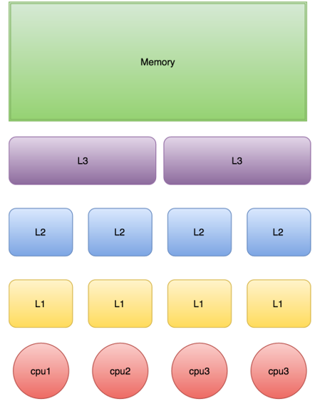

# volatile
---
## 一 CPU三级缓存结构
由于CPU的速度远远大于内存速度，所以CPU设计者们就给CPU加上了缓存(CPU Cache)。 以免运算被内存速度拖累。（就像我们写代码把共享数据做Cache不想被DB存取速度拖累一样），
CPU Cache分成了三个级别：L1，L2，L3。越靠近CPU的缓存越快也越小。所以L1缓存很小但很快，并且紧靠着在使用它的CPU内核。L2大一些，也慢一些，并且仍然只能被一个单独的 CPU 核使用。
L3在现代多核机器中更普遍，仍然更大，更慢，并且被单个插槽上的所有 CPU 核共享。最后，你拥有一块主存，由全部插槽上的所有 CPU 核共享。
当CPU执行运算的时候，它先去L1查找所需的数据，再去L2，然后是L3，最后如果这些缓存中都没有，所需的数据就要去主内存拿。走得越远，运算耗费的时间就越长。
所以如果你在做一些很频繁的事，你要确保数据在L1缓存中。 

## 二 volatile内存可见性
由于cpu的三级缓存结构，在共享变量情况下，当一个线程修改了这个变量的值，新值对于其他线程是无法立即得知的，普通变量的值在线程间传递均需要通过主内存来完成，
volatile关键字在取值时候会从主存中获取修改后的变量值，保证每次都能获取到最新值。实现内存可见性
## 三 volatile禁止指令重排序
什么是指令重排序：是指CPU采用了允许将多条指令不按程序规定的顺序分开发送给各相应电路单元处理。
有volatile修饰的变量，赋值后多执行了一个“load addl $0x0, (%esp)”操作，这个操作相当于一个内存屏障（指令重排序时不能把后面的指令重排序到内存屏障之前的位置）
## 四 volatile不能保证原子性
由于虽然实现内存可见性以及禁止指令重排优化，但是在进行例如i++操作的时候依然是不能够避免线程安全的问题